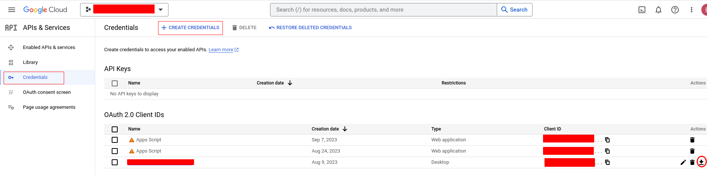
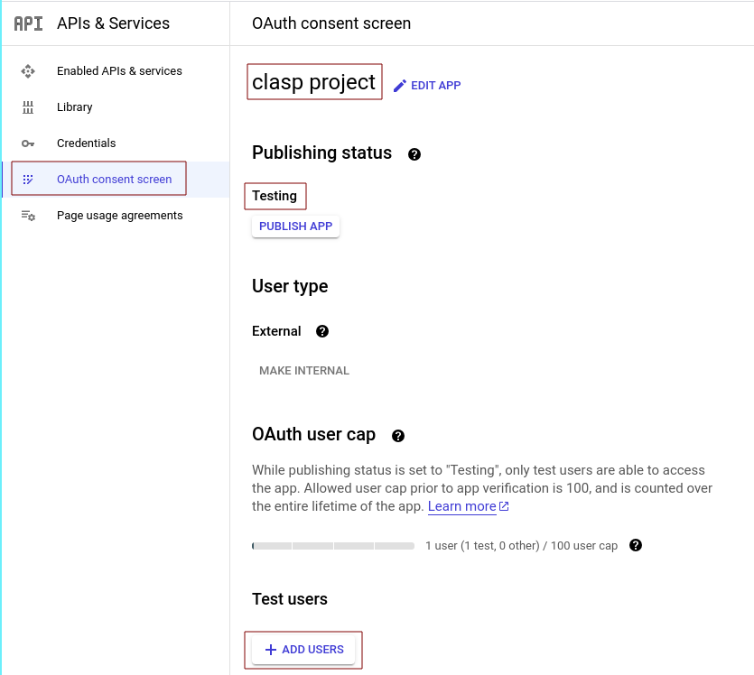
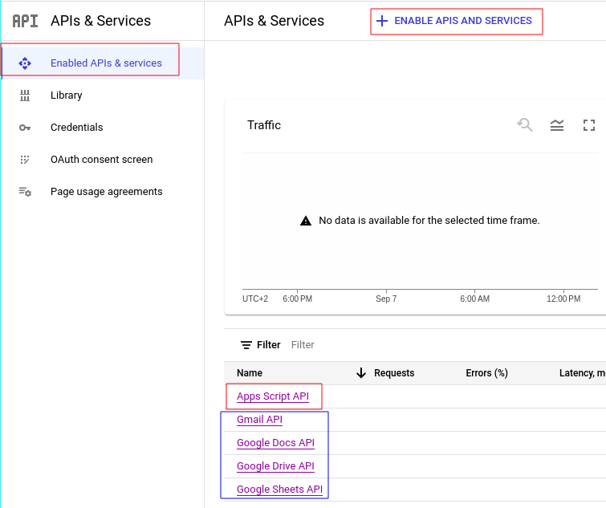
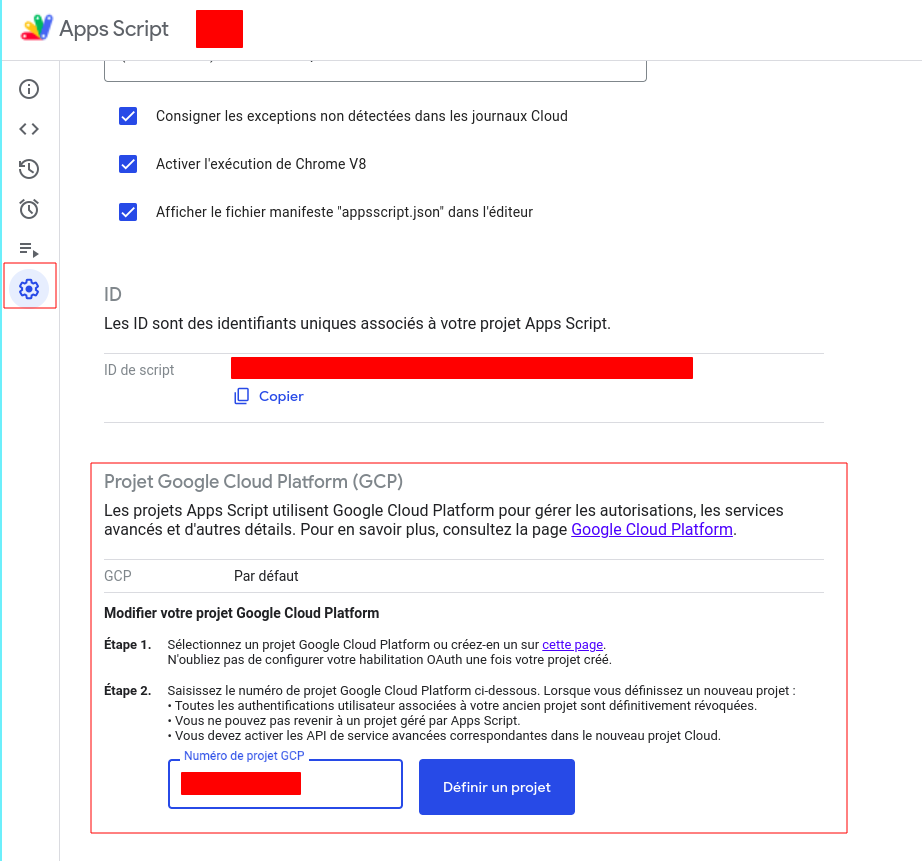

# clasp

[clasp](https://github.com/google/clasp) is a cli tool that helps devoleping Google AppScript Projects.

## Install

- See the following: [instructions](https://github.com/google/clasp#install)

### Google Cloud Project (GCP)

To be able to use certain commands ([advanced-commands](https://github.com/google/clasp#advanced-commands) and [clasp-run](https://github.com/google/clasp#clasp-run)), there should exist a link between Google AppScript projects and a dedicated Google Cloud project.

For more information, about link between Google AppScript projects and Google Cloud Projects see: [GAS projects and Google Cloud Project](https://developers.google.com/apps-script/guides/cloud-platform-projects#switch_to_a_different_google_cloud_platform_project)

- create and configure a Google Cloud Project:
    - create a Google Cloud Project (see: [create GCP](https://cloud.google.com/resource-manager/docs/creating-managing-projects)),

    - report GCP identifiers in file cloud.json 
    
    ```
    {
        "gcp": {
            //Google Cloud Project Id
            "projectId":<id>,
            //Google Cloud Project Number
            "projectNumber":<number>
        }
    }
    ```

    - configure credentials: 

    

        - create credentials and then
        - download credentials file (to be placed in templates/ as creds.json),

    - configure OAuth consent screen: 

    
        
        - Leave the Publishing status to "Testing"
        - Add necessary users (up to 10) 

    - enable required APIs:
    
    

        - App Scripts API is mandatory
    
        - enable APIs used by your App Script Project (if you want to use clasp run)

    - if you want to use ```clasp run```, you must login locally (i.e. with the previous credentials file). You can enable local login directly in the template project by running:
    
        - 
    
        in the directory 'templates'.

- in every Google AppScript Project:
    - change the associated Google Cloud Project to point to the dedicated GC project both 
        - in file: .clasp.json set projectId (done by gas-tools if an init command is used) and 
        - in the Google AppScript project (projectNumber):

            

    - add the following to file appscript.json (done by gas-tools if an init command is used)
        ```  
        "executionApi": {
                "access": "ANYONE"
            }
        ```
## Configuration Files

- .clasp.json: this file defines the GAS projecct from clasp perspective. It contains:
    - **scriptId**  : GAS project identifier
    - **rootDir**   : GAS project root Directory (i.e: the directory from where push action should be undertaken). It matches the build directory of the project.
    - **projectId** : Google Cloud Project bound to the GAS project.

- .clasprc.json: this file enables clasp connection to GAS project. 

## clasp Commands

### Login/logout:

- clasp connection can be 

    - global: ```clasp login```

        this creates a ***.clasprc.json*** file in the home directory (~)

    - or local: ```clasp login --creds <credentials_file>```

        that creates a ***.clasprc.json*** file in the local directory.

- to check connection status: ```clasp login --status```

- to logout: ```clasp logout```

### Push files:

- List files to be pushed: ```clasp status```

- Push files to Google Drive: ```clasp push```
    
This affects the head deployment. Note that this command first ***deletes*** all remote files.

### Cloning/Creation:

- create a lib in given Google Drive Folder: ```clasp create --type standalone --title <name> --parentId <folder_id>```

- create a lib and bound it to a given doc/sheet/slide/form (identified by id): ```clasp create --title <name> --parentId <id>```

- create a doc/sheet/slide/form with an App Script bound to it: ```clasp create --type docs|sheets|slides|forms ```

- clone an existing project (identified by id): ```clasp clone <srciptId>```

### Misc commands:

- Run a function remotely:
```clasp run <function>```

This runs the given function. If no function is specified, it gives users the possibility to select one. 

- Deploy a version: ```clasp deploy```

See [deployments](https://developers.google.com/apps-script/concepts/deployments) for more informations about deployments.

